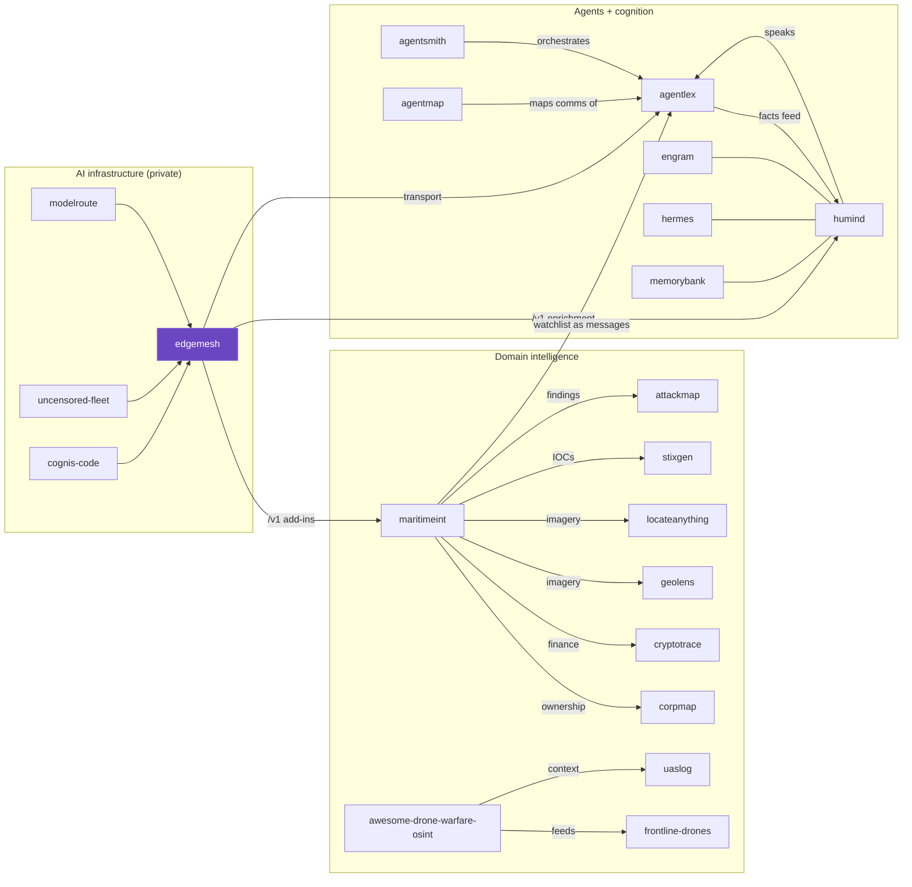

# Cognis interop map

How this repo fits into the wider Cognis suite. Everything is composable and runs on
your own hardware: a **private-AI backbone** (edgemesh), an **agent language + cognition**
layer (agentlex + humind), **domain intelligence** (maritime, drone, OSINT), and shared
**memory / intel** services.



## Key edges

| from | relation | to |
|---|---|---|
| modelroute / uncensored-fleet / cognis-code | are backends meshed by | **edgemesh** |
| edgemesh | serves `/v1` to the add-ins of | maritimeint, humind |
| edgemesh | is the transport/model layer under | agentlex |
| humind | expresses understanding as messages in | agentlex |
| agentlex | knowledge-base facts feed back into | humind |
| agentsmith | orchestrates workflows of | agentlex / humind agents |
| agentmap | discovers & maps the A2A comms of | agentlex agents |
| engram / hermes / memorybank | provide durable memory for | humind (semantic store) |
| maritimeint | cross-references ownership / finance via | corpmap / cryptotrace |
| maritimeint | geolocates imagery via | geolens / locateanything |
| awesome-drone-warfare-osint | feeds the catalog / C-UAS context of | frontline-drones / uaslog |
| maritimeint findings | export to intel formats via | stixgen (STIX) / attackmap (ATT&CK) |
| maritimeint watchlist | can be narrated as | agentlex messages (via humind) |

## Tool-chaining recipes

Every tool reads/writes plain JSON (or a `/v1` OpenAI-compatible endpoint), so they chain
with ordinary pipes. All run on your own hardware; nothing leaves the box.

**1 — Live screen against every sanctions list, on a live AIS box.**
```bash
maritimeint import-sanctions --source all --out sanctions.json          # OFAC + OpenSanctions, merged
maritimeint fetch-ais --source aishub --username YOU \
    --latmin 24 --latmax 27 --lonmin 54 --lonmax 57 --out gulf.json      # live bounding box
maritimeint locate gulf.json --sanctions sanctions.json --fail-on high \
    --format json > hits.json                                            # non-zero exit gates a pipeline
```

**2 — Pivot a flagged hull into ownership + finance + GEOINT.**
```bash
jq -r '.watchlist[] | select(.sanctioned) | .name' hits.json | while read -r vessel; do
  corpmap trace "$vessel"        --format json >> owners.json   # beneficial-ownership graph
  cryptotrace screen --entity "$vessel" >> wallets.json         # on-chain links + sanctions x-ref
done
locateanything infer dock_photo.jpg --endpoint http://localhost:8080/v1   # where was it shot?
```

**3 — Export findings to the formats your SOC already ingests.**
```bash
maritimeint locate gulf.json --sanctions sanctions.json --format json \
  | stixgen from-json --type maritime-indicator > bundle.stix.json        # STIX 2.1
maritimeint locate gulf.json --sanctions sanctions.json --format sarif > mar.sarif  # code-scanning UI
cat hits.json | attackmap map --domain ics > attack.json                  # ATT&CK technique mapping
```

**4 — Narrate the watchlist through cognition + agent language (in-repo demo).**
```bash
python examples/interop_demo.py        # maritimeint -> humind -> agentlex KB rule -> edgemesh brief
```
maritimeint emits each flagged vessel; **humind** extracts entities/affect/salience;
**agentlex** holds them as KB facts and a Horn rule fires `escalate(vessel)`; **edgemesh**
(if a `/v1` is reachable) writes the human brief. Each hop degrades gracefully if the
sibling tool or a model backend isn't installed.

**5 — Counter-UAS + maritime fusion (drone events near a flagged hull).**
```bash
uaslog parse sensor.log --format json > drone_events.json                 # C-UAS detections
maritimeint analyze gulf.json --format json > vessels.json
# correlate by time/geo in your notebook, or feed both to humind for a single situational brief
```

## Reference stacks

Pick the smallest stack that answers your question; each is a subset of the suite.

| Stack | Repos | Flow |
|---|---|---|
| **Sanctions-evasion screening** | maritimeint · *(OFAC/OFSI/EU/OpenSanctions feeds)* | importers → `locate --fail-on` → pass/fail gate |
| **GEOINT fusion** | maritimeint · locateanything · geolens · geoaoi-pro | imagery → geolocate → plot on AOI/MIL-STD-2525 |
| **Ownership & finance** | maritimeint · corpmap · cryptotrace · personagraph | hull → beneficial owner → wallets → identity dossier |
| **Threat-intel export** | maritimeint · stixgen · iocextract · attackmap · ttphunt | findings → STIX/IOCs → ATT&CK → hunt |
| **Counter-UAS maritime** | maritimeint · uaslog · awesome-drone-warfare-osint · frontline-drones | AIS + drone telemetry → correlated situational picture |
| **Cognition + agents** | humind · agentlex · agentsmith · agentmap · engram | extract → KB facts/rules → orchestrate → durable memory |
| **Private-AI backbone** | edgemesh · modelroute · uncensored-fleet · cognis-code | one `/v1` across the fleet powering every tool's add-ins |

Every domain stack can sit **on top of** the private-AI backbone: point any tool's add-ins
at an `edgemesh` gateway (`MARITIMEINT_ENDPOINT` / `OPENAI_BASE_URL`) and the same fleet
serves vision, reasoning, and narration to all of them.

> Generated as part of a cross-repo interop pass. Each repo links here so the suite is
> navigable as one composable system. **300+ tools →** [github.com/cognis-digital](https://github.com/cognis-digital)
