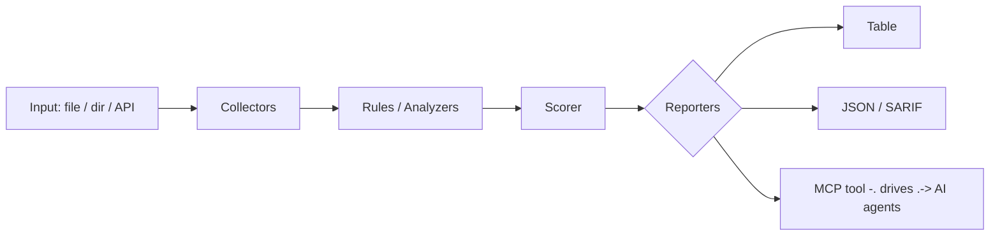

<a name="top"></a>
<div align="center">


# MARITIMEINT

### AIS vessel tracking & sanctions-evasion anomaly detection


[](https://pypi.org/project/cognis-maritimeint/) [](https://github.com/cognis-digital/maritimeint/actions) [](LICENSE) [](https://github.com/cognis-digital)

*OSINT / SIGINT — open-source intelligence collection and correlation.*

</div>

```bash
pip install cognis-maritimeint
maritimeint scan .            # → prioritized findings in seconds
```

## Contents

- [Why maritimeint?](#why) · [Features](#features) · [Quick start](#quick-start) · [Example](#example) · [Architecture](#architecture) · [AI stack](#ai-stack) · [How it compares](#how-it-compares) · [Integrations](#integrations) · [Install anywhere](#install-anywhere) · [Related](#related) · [Contributing](#contributing)

<a name="why"></a>
## Why maritimeint?

AIS vessel tracking & sanctions-evasion anomaly detection — without standing up heavyweight infrastructure.

`maritimeint` is single-purpose, scriptable, and self-hostable: point it at a target, get prioritized results in the format your workflow already speaks (table · JSON · SARIF), gate CI on it, and let agents drive it over MCP.

<div align="right"><a href="#top">↑ back to top</a></div>

<a name="features"></a>
## Features

- ✅ Parse Messages
- ✅ Load Messages
- ✅ Haversine Nm
- ✅ Detect Gaps
- ✅ Detect Speed Jumps
- ✅ Detect Loitering
- ✅ Detect Spoofing
- ✅ Detect Rendezvous (ship-to-ship transfer signature)
- ✅ **LocateAnything watchlist** — one call → prioritized, *explained* grey-fleet watchlist (HIGH/MEDIUM/LOW + plain-language reasons)
- ✅ **Sanctions cross-reference** — match tracked vessels to an OFAC/EU/OFSI-style list by MMSI / IMO / name
- ✅ **Composable AI add-ins** — optional vision (imagery triage) + reasoning (narrative assessment) that *stack* onto the stdlib core, via the Cognis fleet / **edgemesh**; hardware/availability-gated (off if no backend)
- ✅ **Multi-level interactive menu** (`maritimeint menu`)
- ✅ Runs on Linux/macOS/Windows · Docker · devcontainer
- ✅ Ports in Python, JavaScript, Go, and Rust (`ports/`)

## Grey-fleet watchlist + AI add-ins

```bash
maritimeint locate demos/ais_sample.json --sanctions demos/sanctions_sample.json
#  [HIGH ] 210111000 NEPTUNE STAR [SANCTIONED]  score=12
#        - ON SANCTIONS LIST (...)   - AIS gap 9h (going dark)
#        - rendezvous 90min, 0.008nm (possible ship-to-ship transfer)
maritimeint addins                 # which AI add-ins are reachable right now
maritimeint locate <ais.json> --ai # augment with the reasoning model if a backend is up
maritimeint menu                   # interactive, multi-level

# point the add-ins at a LIVE edgemesh gateway (or any OpenAI-compatible /v1):
maritimeint locate <ais.json> --endpoint http://<edgemesh-host>:8780 --model <id>
maritimeint vision https://.../sentinel1_scene.png --endpoint http://<edgemesh-host>:8780 --model <vl-model>
```

The detection core is **pure stdlib and always works**. Add-ins *stack* extra
capability when a model backend is reachable — point them at an **edgemesh** gateway
(which unifies `uncensored-fleet`, `cognis-code`, and a vision/VL backend behind one
`/v1`), or at those fleet endpoints directly. If nothing's up, add-ins stay off and the
core watchlist still runs. Detection/situational-awareness only — see the disclaimer.

<div align="right"><a href="#top">↑ back to top</a></div>

<a name="quick-start"></a>
## Quick start

```bash
pip install cognis-maritimeint
maritimeint --version
maritimeint analyze demos/ais_sample.json            # full detector suite + risk ranking
maritimeint locate demos/ais_sample.json             # prioritized, explained watchlist
maritimeint locate demos/ais_sample.csv              # CSV in too (real AIS-provider exports)
maritimeint --format json locate demos/ais_sample.json   # machine-readable
maritimeint locate fleet.csv --sanctions ofac.json --fail-on high   # compliance/CI gate (exit≠0)
maritimeint menu                                     # interactive multi-level menu
```

**Works with whatever model backend you run** — set `MARITIMEINT_ENDPOINT` (or
`OPENAI_BASE_URL`) to your fleet/gateway, or let it auto-discover one on the common
local ports. No backend? The stdlib detection core still runs; AI add-ins just stay off.

<div align="right"><a href="#top">↑ back to top</a></div>

<a name="example"></a>
## Example

```text
$ maritimeint scan .
  [HIGH    ] MAR-001  example finding             (./src/app.py)
  [MEDIUM  ] MAR-002  another signal              (./config.yaml)

  2 findings · risk score 5 · 38ms
```

<div align="right"><a href="#top">↑ back to top</a></div>

<a name="architecture"></a>
## Architecture



<div align="right"><a href="#top">↑ back to top</a></div>

<a name="ai-stack"></a>
## Use it from any AI stack

`maritimeint` is interoperable with every popular way of using AI:

- **MCP server** — `maritimeint mcp` (Claude Desktop, Cursor, Cognis.Studio, [uncensored-fleet](https://github.com/cognis-digital/uncensored-fleet))
- **OpenAI-compatible / JSON** — pipe `maritimeint scan . --format json` into any agent or LLM
- **LangChain · CrewAI · AutoGen · LlamaIndex** — wrap the CLI/JSON as a tool in one line
- **CI / scripts** — exit codes + SARIF for non-AI pipelines

<div align="right"><a href="#top">↑ back to top</a></div>

<a name="how-it-compares"></a>
## How it compares

| | **Cognis maritimeint** | bellingcat |
|---|:---:|:---:|
| Self-hostable, no account | ✅ | varies |
| Single command, zero config | ✅ | ⚠️ |
| JSON + SARIF for CI | ✅ | varies |
| MCP-native (AI agents) | ✅ | ❌ |
| Polyglot ports (JS/Go/Rust) | ✅ | ❌ |
| Open license | ✅ COCL | varies |

*Built in the spirit of **bellingcat/toolkit**, re-framed the Cognis way. Missing a credit? Open a PR.*

<div align="right"><a href="#top">↑ back to top</a></div>

<a name="integrations"></a>
## Integrations

Pipes into your stack: **SARIF** for code-scanning, **JSON** for anything, an **MCP server** (`maritimeint mcp`) for AI agents, and a webhook forwarder for SIEM/Slack/Jira. See [`docs/INTEGRATIONS.md`](docs/INTEGRATIONS.md).

<div align="right"><a href="#top">↑ back to top</a></div>

<a name="install-anywhere"></a>
## Install — every way, every platform

```bash
pip install "git+https://github.com/cognis-digital/maritimeint.git"    # pip (works today)
pipx install "git+https://github.com/cognis-digital/maritimeint.git"   # isolated CLI
uv tool install "git+https://github.com/cognis-digital/maritimeint.git" # uv
pip install cognis-maritimeint                                          # PyPI (when published)
docker run --rm ghcr.io/cognis-digital/maritimeint:latest --help        # Docker
brew install cognis-digital/tap/maritimeint                             # Homebrew tap
curl -fsSL https://raw.githubusercontent.com/cognis-digital/maritimeint/main/install.sh | sh
```

| Linux | macOS | Windows | Docker | Cloud |
|---|---|---|---|---|
| `scripts/setup-linux.sh` | `scripts/setup-macos.sh` | `scripts/setup-windows.ps1` | `docker run ghcr.io/cognis-digital/maritimeint` | [DEPLOY.md](docs/DEPLOY.md) (AWS/Azure/GCP/k8s) |

<div align="right"><a href="#top">↑ back to top</a></div>

<a name="related"></a>
## Related Cognis tools — the maritime / drone / defense-OSINT cluster

maritimeint sits in a wider open suite of **defensive, analytical** intelligence tools.
Compose them: geolocate imagery, map ownership behind a flagged vessel, screen for
sanctions, and correlate drone-detection events — all on your own hardware.

**Maritime & drone domain awareness**
- [`uaslog`](https://github.com/cognis-digital/uaslog) — counter-UAS telemetry/log analyzer: flags drone-detection events, RF bands, and tracks
- [`awesome-drone-warfare-osint`](https://github.com/cognis-digital/awesome-drone-warfare-osint) — citation-grade dataset: 8,300+ foreign components across 195+ platforms + a `query.py` compliance CLI
- [`frontline-drones`](https://github.com/cognis-digital/frontline-drones) — descriptive catalog of frontline & commercial drones + a counter-UAS sensor selection guide

**Geospatial / GEOINT**
- [`locateanything`](https://github.com/cognis-digital/locateanything) — infer where a photo was taken using a local vision + reasoning model (OSINT geolocation)
- [`geolens`](https://github.com/cognis-digital/geolens) — image geolocation toolkit: EXIF, sun-shadow, OCR, reverse-search
- [`geoaoi-pro`](https://github.com/cognis-digital/geoaoi-pro) — MIL-STD-2525 / APP-6 symbology + area-of-interest helpers (QGIS-compatible)

**Sanctions · ownership · finance**
- [`corpmap`](https://github.com/cognis-digital/corpmap) — corporate structure & beneficial-ownership mapper (who really owns that hull)
- [`cryptotrace`](https://github.com/cognis-digital/cryptotrace) — blockchain investigator: ETH/BTC clustering + sanctions cross-reference

**Threat intel · identity**
- [`personagraph`](https://github.com/cognis-digital/personagraph) — identity-resolution dossier (username/email/phone, cross-platform)
- [`stixgen`](https://github.com/cognis-digital/stixgen) · [`iocextract`](https://github.com/cognis-digital/iocextract) · [`attackmap`](https://github.com/cognis-digital/attackmap) · [`ttphunt`](https://github.com/cognis-digital/ttphunt) — IOC → STIX, ATT&CK mapping & hunting
- [`darkmirror`](https://github.com/cognis-digital/darkmirror) — public leak-site index mirror for brand/exposure monitoring

**Run it all privately** → [`edgemesh`](https://github.com/cognis-digital/edgemesh) (one OpenAI-compatible `/v1` across your whole fleet) · [`uncensored-fleet`](https://github.com/cognis-digital/uncensored-fleet)

**Explore the suite →** 280+ open security & OSINT tools at [github.com/cognis-digital](https://github.com/cognis-digital) · [⭐ awesome-cognis](https://github.com/cognis-digital/awesome-cognis)

<div align="right"><a href="#top">↑ back to top</a></div>

<a name="contributing"></a>
## Contributing

PRs, new rules, and demo scenarios are welcome under the collaboration-pull model — see [CONTRIBUTING.md](CONTRIBUTING.md) and [SECURITY.md](SECURITY.md).

> ### ⭐ If `maritimeint` saved you time, **star it** — it genuinely helps others find it.

## License

Source-available under the **Cognis Open Collaboration License (COCL) v1.0** — free for personal, internal-evaluation, research, and educational use; **commercial / production use requires a license** (licensing@cognis.digital). See [LICENSE](LICENSE).

---

<div align="center"><sub><b><a href="https://cognis.digital">Cognis Digital</a></b> · one of 170+ tools in the <a href="https://github.com/cognis-digital/cognis-neural-suite">Cognis Neural Suite</a> · <i>Making Tomorrow Better Today</i></sub></div>
