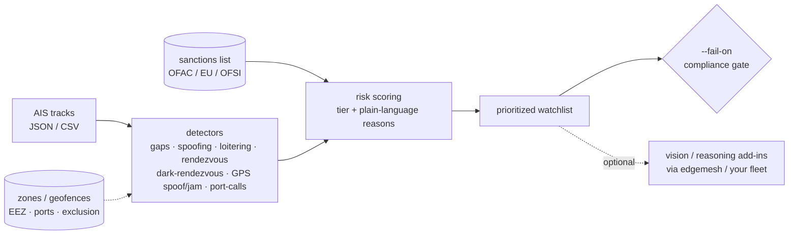

<a name="top"></a>
<div align="center">


# MARITIMEINT

### AIS vessel tracking & sanctions-evasion anomaly detection


[](https://pypi.org/project/cognis-maritimeint/) [](https://github.com/cognis-digital/maritimeint/actions) [](LICENSE) [](https://github.com/cognis-digital)

*OSINT / SIGINT — open-source intelligence collection and correlation.*

</div>

```bash
pip install cognis-maritimeint
maritimeint locate demos/ais_sample.json   # → prioritized grey-fleet watchlist in seconds
```

> ## 🆕 New in v0.8 — *spatial intelligence, dark-STS & live 2026 sources*
>
> | | What changed | Try it |
> |---|---|---|
> | 🗺️ | **Zone intelligence (geofencing)** — define EEZs, sanctioned ports & exclusion / war-risk zones as GeoJSON; **every finding is tagged with *where* it happened** | `maritimeint zones ais.json --zones zones.geojson` |
> | 🌑 | **Dark-rendezvous correlation** — the real dark-STS move: one tanker kills AIS while another loiters at the spot (the case plain `rendezvous` can't see) | `maritimeint dark-rendezvous ais.json` |
> | 📡 | **GPS spoofing & jamming** — flags *circling* spoof tracks and jamming hotspots where many vessels snap to one synthetic position | `maritimeint gps ais.json` |
> | ⚓ | **Port-call sequencing** — reconstructs each vessel's itinerary and flags **sanctioned-port legs** | `maritimeint port-calls ais.json --itinerary` |
> | 🔴 | **3× more sources + real-time scraping** — source catalog **tripled with live 2026 feeds**, plus a new **keyless `livesearch`** module that pulls current OSINT at runtime (Google News · RSS/Atom · DuckDuckGo), no API keys | `python -m livesearch "sanctioned tanker" --when 7d` |
>
> *All four detectors are pure-stdlib, additive layers folded into `analyze` / `locate` — see [the v0.8 walkthrough](#v08) and [`demos/04-dark-sts-zones`](demos/04-dark-sts-zones).*

## Contents

- [Why maritimeint?](#why) · [Features](#features) · [What's new in v0.8](#v08) · [Quick start](#quick-start) · [Example](#example) · [Architecture](#architecture) · [AI stack](#ai-stack) · [How it compares](#how-it-compares) · [Integrations](#integrations) · [Install anywhere](#install-anywhere) · [Related](#related) · [Contributing](#contributing)

<a name="why"></a>
## Why maritimeint?

AIS vessel tracking & sanctions-evasion anomaly detection — without standing up heavyweight infrastructure.

`maritimeint` is single-purpose, scriptable, and self-hostable: point it at a target, get prioritized results in the format your workflow already speaks (table · JSON · SARIF), gate CI on it, and let agents drive it over MCP.

<div align="right"><a href="#top">↑ back to top</a></div>

<a name="features"></a>
## Features

- ✅ Parse Messages
- ✅ Load Messages
- ✅ Haversine Nm
- ✅ Detect Gaps
- ✅ Detect Speed Jumps
- ✅ Detect Loitering
- ✅ Detect Spoofing
- ✅ Detect Rendezvous (ship-to-ship transfer signature)
- ✅ **Dark-rendezvous correlation** `v0.8` — one vessel goes dark while another loiters at the vanish point (the dark-STS signature `rendezvous` misses, because only one party is broadcasting)
- ✅ **Zone intelligence / geofencing** `v0.8` — GeoJSON or native polygons + great-circle "circle" zones (EEZs · sanctioned ports · exclusion / war-risk); entry/exit/dwell events + **every positional finding tagged with its zone**
- ✅ **GPS spoofing & jamming** `v0.8` — `circle_spoof` (a track populating the whole compass around a tight centroid) + `gps_jamming` (many distinct MMSIs pinned to one synthetic position)
- ✅ **Port-call sequencing** `v0.8` — dwell-based port calls from a built-in (or custom) registry, sequenced into per-vessel itineraries with **sanctioned-port legs flagged**
- ✅ **Live 2026 sources + real-time scraping** `v0.8` — `livesearch.py`: keyless, stdlib, real-time web-search + RSS/Atom ingestion (`web_search` · `fetch_feed` · `ddg_search` · `harvest`); the [`SOURCES.md`](SOURCES.md) catalog now carries 3× the feeds, queries & APIs
- ✅ **Native intel export** `v0.9` — turn any analysis into **GeoJSON** (Leaflet/Mapbox/QGIS/kepler.gl), **KML** (Google Earth / marine charts), **STIX 2.1** bundle (threat-intel platforms) or **CSV** — zero dependencies: `maritimeint export ais.json --to geojson`
- ✅ **LocateAnything watchlist** — one call → prioritized, *explained* grey-fleet watchlist (HIGH/MEDIUM/LOW + plain-language reasons)
- ✅ **Sanctions cross-reference** — match tracked vessels to an OFAC/EU/OFSI-style list by MMSI / IMO / name
- ✅ **Composable AI add-ins** — optional vision (imagery triage) + reasoning (narrative assessment) that *stack* onto the stdlib core, via the Cognis fleet / **edgemesh**; hardware/availability-gated (off if no backend)
- ✅ **Multi-level interactive menu** (`maritimeint menu`)
- ✅ Runs on Linux/macOS/Windows · Docker · devcontainer
- ✅ Ports in Python, JavaScript, Go, and Rust (`ports/`)

## Grey-fleet watchlist + AI add-ins

```bash
maritimeint locate demos/ais_sample.json --sanctions demos/sanctions_sample.json
#  [HIGH ] 210111000 NEPTUNE STAR [SANCTIONED]  score=12
#        - ON SANCTIONS LIST (...)   - AIS gap 9h (going dark)
#        - rendezvous 90min, 0.008nm (possible ship-to-ship transfer)
maritimeint addins                 # which AI add-ins are reachable right now
maritimeint locate <ais.json> --ai # augment with the reasoning model if a backend is up
maritimeint menu                   # interactive, multi-level

# point the add-ins at a LIVE edgemesh gateway (or any OpenAI-compatible /v1):
maritimeint locate <ais.json> --endpoint http://<edgemesh-host>:8780 --model <id>
maritimeint vision https://.../sentinel1_scene.png --endpoint http://<edgemesh-host>:8780 --model <vl-model>
```

### Real sanctions data — every major list, one format

Screen against actual government designations, not a sample. Pull from any single source,
or `--source all` to fetch + **merge** every public feed (de-duplicated by IMO → MMSI →
name, with each vessel's source lists unioned):

```bash
maritimeint import-sanctions --source all --out sanctions.json     # OFAC + OpenSanctions, merged
maritimeint import-sanctions --source opensanctions                # aggregates OFAC/EU/UK/UN
maritimeint import-sanctions --source ofsi --from-file ConList.csv # UK OFSI (downloaded)
maritimeint import-sanctions --source eu   --from-file eu_list.xml # EU consolidated (downloaded)
maritimeint locate fleet.csv --sanctions sanctions.json --fail-on high
```

| `--source` | Authority | Format | Fetch |
|---|---|---|---|
| `ofac` | US Treasury OFAC SDN | CSV | live URL |
| `opensanctions` | OpenSanctions (OFAC/EU/UK/UN) | FtM JSONL | live URL |
| `ofsi` | UK HM Treasury OFSI | CSV | `--from-file` |
| `eu` | EU consolidated list | XML | `--from-file` |
| `all` | OFAC + OpenSanctions, merged | — | live URLs |

> `import-ofac` (OFAC-only) remains for back-compat. OFSI/EU publish at drifting / gated
> endpoints, so those parse a list you download. See [SOURCES.md](SOURCES.md).

### Edge / air-gap data feeds — OFAC SDN that works disconnected

maritimeint bundles a **stdlib-only** data-feed ingestion engine
(`maritimeint/datafeeds.py` + catalog `data_feeds_2026.json`) so the real OFAC
sanctions list keeps working on shipboard / disconnected / air-gapped edge gear:
keyless HTTPS fetch → on-disk cache → **offline** re-serve → sneakernet snapshot.

The `feeds` command exposes the maritime-relevant slice of the shared Cognis feed
catalog (just the OFAC SDN list for this tool):

```bash
maritimeint feeds list                              # relevant feeds + cache freshness
maritimeint feeds update ofac-sdn                   # fetch + cache (connected box)
maritimeint feeds get ofac-sdn --offline            # re-serve from cache, no network
```

| Feed id | Authority | Source URL | Format |
|---|---|---|---|
| `ofac-sdn` | US Treasury OFAC | `https://www.treasury.gov/ofac/downloads/sdn.csv` | CSV |

**Real enrichment.** The cached SDN list feeds straight into vessel screening —
designated **vessels** (OFAC records IMO/MMSI in the Remarks field) become the
`--sanctions` list, and the whole path runs offline:

```bash
maritimeint import-ofac --from-feed --offline --out ofac.json   # SDN from cache, no network
maritimeint locate ais.json --sanctions ofac.json               # flag sanctioned vessels
```

**Air-gap workflow (sneakernet).** Snapshot the cache on a connected box, carry it
into the enclave, and every screen runs with zero network:

```bash
# connected box
maritimeint feeds update ofac-sdn
maritimeint feeds snapshot-export feeds.tar.gz
# inside the air gap (after transfer)
maritimeint feeds snapshot-import feeds.tar.gz
maritimeint import-ofac --from-feed --offline --out ofac.json
```

The cache location is `COGNIS_FEEDS_CACHE` (default `~/.cache/cognis-feeds`).
See [`demos/feeds_offline_demo.sh`](demos/feeds_offline_demo.sh) for the full
offline run. Tests pin `COGNIS_FEEDS_CACHE` at a committed fixture and use
`offline=True`, so CI is **green with no network**.

### Live AIS in, watchlist out

Normalize any AIS provider's export (or pull a live bounding box) into the detectors —
field names are aliased automatically and unix timestamps become ISO UTC:

```bash
maritimeint fetch-ais --source file --from-file provider_export.csv --out ais.json
maritimeint fetch-ais --source aishub --username YOU --latmin 24 --latmax 27 --lonmin 54 --lonmax 57
maritimeint analyze ais.json                                       # then run the detectors
```
(aisstream.io is a websocket stream — collect `PositionReport` messages to JSON, then
`fetch-ais --source file`.)

The detection core is **pure stdlib and always works**. Add-ins *stack* extra
capability when a model backend is reachable — point them at an **edgemesh** gateway
(which unifies `uncensored-fleet`, `cognis-code`, and a vision/VL backend behind one
`/v1`), or at those fleet endpoints directly. If nothing's up, add-ins stay off and the
core watchlist still runs. Detection/situational-awareness only — see the disclaimer.

<div align="right"><a href="#top">↑ back to top</a></div>

<a name="quick-start"></a>
## Quick start

```bash
pip install cognis-maritimeint
maritimeint --version
maritimeint analyze demos/ais_sample.json            # full detector suite + risk ranking
maritimeint locate demos/ais_sample.json             # prioritized, explained watchlist
maritimeint locate demos/ais_sample.csv              # CSV in too (real AIS-provider exports)
maritimeint --format json locate demos/ais_sample.json   # machine-readable
maritimeint locate fleet.csv --sanctions ofac.json --fail-on high   # compliance/CI gate (exit≠0)
maritimeint export demos/ais_sample.json --to geojson -o findings.geojson   # map-ready
maritimeint menu                                     # interactive multi-level menu
```

### Export & share the intelligence

`maritimeint export` runs the full detector suite and serializes the findings
into the format your workflow needs — **no extra dependencies**:

```bash
maritimeint export ais.json --to geojson -o findings.geojson  # Leaflet/Mapbox/QGIS/kepler.gl
maritimeint export ais.json --to kml     -o findings.kml      # Google Earth / marine charts
maritimeint export ais.json --to stix    -o findings.json     # STIX 2.1 bundle for TIPs
maritimeint export ais.json --to csv     -o findings.csv      # spreadsheets / notebooks
maritimeint export ais.json --to geojson --zones eez.geojson  # tag findings with zones first
```

GeoJSON/KML use `[lon, lat]` ordering and render every positional finding as a
point or track; the STIX bundle emits one deterministic-id `indicator` per
finding (ATT&CK-friendly, `x_maritime` custom props preserved). For pushing a
*watchlist* to MISP/Splunk/Elastic/Slack, see `locate --emit` (via cognis-connect).

**Works with whatever model backend you run** — set `MARITIMEINT_ENDPOINT` (or
`OPENAI_BASE_URL`) to your fleet/gateway, or let it auto-discover one on the common
local ports. No backend? The stdlib detection core still runs; AI add-ins just stay off.

<div align="right"><a href="#top">↑ back to top</a></div>

<a name="example"></a>
## Example

```text
$ maritimeint locate demos/ais_sample.json --sanctions demos/sanctions_sample.json
MARITIMEINT watchlist (3 vessels, highest risk first):
  [HIGH  ] 210111000 NEPTUNE STAR [SANCTIONED]  score=12
        - ON SANCTIONS LIST (SAMPLE-EO14024)
        - AIS gap 9.0h (going dark)
        - rendezvous 90.0min, min 0.008nm (possible ship-to-ship transfer)
  [MEDIUM] 210444000 GHOST RUNNER  score=3
        - implausible 462.2kn position jump (possible spoofing)
```

<div align="right"><a href="#top">↑ back to top</a></div>

<a name="v08"></a>
## v0.8 — spatial intelligence, dark-STS & live sources

Four additive, pure-stdlib detection layers (all folded into `analyze` / `locate`, so
they enrich the watchlist automatically) plus a keyless real-time source feed. Run the
whole story end-to-end with [`demos/04-dark-sts-zones`](demos/04-dark-sts-zones):

```bash
# full suite + spatial context: every finding tagged with the zone it falls in
maritimeint --format json analyze demos/04-dark-sts-zones/feed.json \
    --zones demos/04-dark-sts-zones/zones.geojson

maritimeint dark-rendezvous demos/04-dark-sts-zones/feed.json   # dark-STS correlation
maritimeint gps             demos/04-dark-sts-zones/feed.json   # spoofing / jamming
maritimeint zones           demos/04-dark-sts-zones/feed.json --zones demos/04-dark-sts-zones/zones.geojson
maritimeint port-calls      demos/04-dark-sts-zones/feed.json --itinerary   # Kharg (sanctioned) → Singapore
```

**🗺️ Zone intelligence (`zones.py`)** — define areas an analyst cares about as GeoJSON
(`FeatureCollection` / `Feature` / geometry) or the native form, with **polygon**
(ray-cast point-in-polygon) or **circle** (`center` + `radius_nm`) geometry. `--zones`
on `analyze`/`locate` annotates every positional finding with the zone(s) it falls in;
the `zones` command reports entry/exit + dwell, severity-weighted by `kind`
(`sanctioned_port` / `exclusion` / `war_risk` → high).

**🌑 Dark-rendezvous (`detect_dark_rendezvous`)** — `rendezvous` needs *both* vessels
broadcasting. This catches the evasion that matters: vessel A switches off AIS, and
vessel B keeps reporting **at A's vanish / reappear point during the dark window** — the
lightering ship sitting on the spot. Returns the pair, the closest approach, and the gap.

**📡 GPS spoofing & jamming (`detect_gps_anomalies`)** — two artifacts:
`circle_spoof` measures **angular coverage around the track centroid** (a spoofed
"circling" track populates the whole compass within a tiny radius; a straight passage
never does), and `gps_jamming` finds **many distinct MMSIs snapped to one position**
within a short window (the classic jamming hotspot).

**⚓ Port-call sequencing (`ports.py`)** — infers dwell-based calls from a built-in
registry (includes Kharg Island, Bandar Abbas, Primorsk, Ust-Luga, Nakhodka, Tartus,
Nampo…) or your own (`--ports`), then `--itinerary` sequences each vessel's calls and
flags the **load-dirty → sell-clean** legs that touch a sanctioned / high-risk port.

**🔴 Live 2026 sources + real-time scraping (`livesearch.py`)** — keyless, zero-dependency
real-time ingestion so monitoring stays *current*, not static:

```bash
python -m livesearch "shadow fleet sanctioned tanker" --when 7d   # live Google-News RSS search
python -m livesearch --feed https://gcaptain.com/feed/ --json     # any RSS/Atom feed
python -c "import livesearch as ls; print(len(ls.harvest([{'query':'OFAC sanctioned vessel'}, \
    'https://gcaptain.com/feed/'], since_days=14)))"               # mixed harvest, deduped, 2026-only
```

`web_search()` uses Google News RSS as a keyless search backend, `fetch_feed()` parses
any RSS 2.0 / Atom feed, `ddg_search()` scrapes DuckDuckGo HTML, and `harvest()` runs a
mixed list of feeds + queries, keeping only recent (≥ 2026) items, de-duped, newest-first.

<div align="right"><a href="#top">↑ back to top</a></div>

<a name="architecture"></a>
## Architecture



<div align="right"><a href="#top">↑ back to top</a></div>

<a name="ai-stack"></a>
## Use it from any AI stack

`maritimeint` is interoperable with every popular way of using AI:

- **MCP server** — `maritimeint mcp` (Claude Desktop, Cursor, Cognis.Studio, [uncensored-fleet](https://github.com/cognis-digital/uncensored-fleet))
- **OpenAI-compatible / JSON** — pipe `maritimeint --format json locate <ais.json>` into any agent or LLM
- **LangChain · CrewAI · AutoGen · LlamaIndex** — wrap the CLI/JSON as a tool in one line
- **CI / scripts** — exit codes + SARIF for non-AI pipelines

<div align="right"><a href="#top">↑ back to top</a></div>

<a name="how-it-compares"></a>
## How it compares

| | **Cognis maritimeint** | bellingcat |
|---|:---:|:---:|
| Self-hostable, no account | ✅ | varies |
| Single command, zero config | ✅ | ⚠️ |
| JSON + SARIF for CI | ✅ | varies |
| MCP-native (AI agents) | ✅ | ❌ |
| Polyglot ports (JS/Go/Rust) | ✅ | ❌ |
| Open license | ✅ COCL | varies |

*Built in the spirit of **bellingcat/toolkit**, re-framed the Cognis way. Missing a credit? Open a PR.*

<div align="right"><a href="#top">↑ back to top</a></div>

<a name="integrations"></a>
## Integrations

Pipes into your stack: **SARIF** for code-scanning, **JSON** for anything, an **MCP server** (`maritimeint mcp`) for AI agents, and a webhook forwarder for SIEM/Slack/Jira. See [`docs/INTEGRATIONS.md`](docs/INTEGRATIONS.md).

**Forward the watchlist to your SOC** via [`cognis-connect`](https://github.com/cognis-digital/cognis-connect) — STIX/MISP/Sigma/Splunk/Elastic/Slack/Discord/webhook, in one flag:

```bash
pip install "cognis-maritimeint[connect]"
maritimeint locate fleet.csv --sanctions s.json --emit stix > bundle.stix.json
maritimeint locate fleet.csv --sanctions s.json --emit splunk --emit-url $HEC --emit-token $TOK
maritimeint locate fleet.csv --sanctions s.json --emit slack  --emit-url $SLACK --emit-dry-run
```
Each flagged vessel becomes a canonical `Finding` (sanctioned → critical). `--emit-dry-run` previews the exact request without sending.

<div align="right"><a href="#top">↑ back to top</a></div>

<a name="install-anywhere"></a>
## Install — every way, every platform

```bash
pip install "git+https://github.com/cognis-digital/maritimeint.git"    # pip (works today)
pipx install "git+https://github.com/cognis-digital/maritimeint.git"   # isolated CLI
uv tool install "git+https://github.com/cognis-digital/maritimeint.git" # uv
pip install cognis-maritimeint                                          # PyPI (when published)
docker run --rm ghcr.io/cognis-digital/maritimeint:latest --help        # Docker
brew install cognis-digital/tap/maritimeint                             # Homebrew tap
curl -fsSL https://raw.githubusercontent.com/cognis-digital/maritimeint/main/install.sh | sh
```

| Linux | macOS | Windows | Docker | Cloud |
|---|---|---|---|---|
| `scripts/setup-linux.sh` | `scripts/setup-macos.sh` | `scripts/setup-windows.ps1` | `docker run ghcr.io/cognis-digital/maritimeint` | [DEPLOY.md](docs/DEPLOY.md) (AWS/Azure/GCP/k8s) |

<div align="right"><a href="#top">↑ back to top</a></div>

<a name="related"></a>
## Related Cognis tools — the maritime / drone / defense-OSINT cluster

maritimeint sits in a wider open suite of **defensive, analytical** intelligence tools.
Compose them: geolocate imagery, map ownership behind a flagged vessel, screen for
sanctions, and correlate drone-detection events — all on your own hardware.

> 🔗 **[INTEROP.md](INTEROP.md)** — copy-paste tool-chaining recipes (sanctions screen →
> ownership/finance pivot → STIX/ATT&CK export → cognition/agents) + seven named
> reference stacks. Run a live chain end-to-end (offline):
> `python examples/interop_demo.py` — maritimeint → humind → agentlex → edgemesh brief.

**Maritime & drone domain awareness**
- [`uaslog`](https://github.com/cognis-digital/uaslog) — counter-UAS telemetry/log analyzer: flags drone-detection events, RF bands, and tracks
- [`awesome-drone-warfare-osint`](https://github.com/cognis-digital/awesome-drone-warfare-osint) — citation-grade dataset: 8,300+ foreign components across 195+ platforms + a `query.py` compliance CLI
- [`frontline-drones`](https://github.com/cognis-digital/frontline-drones) — descriptive catalog of frontline & commercial drones + a counter-UAS sensor selection guide

**Geospatial / GEOINT**
- [`locateanything`](https://github.com/cognis-digital/locateanything) — infer where a photo was taken using a local vision + reasoning model (OSINT geolocation)
- [`geolens`](https://github.com/cognis-digital/geolens) — image geolocation toolkit: EXIF, sun-shadow, OCR, reverse-search
- [`geoaoi-pro`](https://github.com/cognis-digital/geoaoi-pro) — MIL-STD-2525 / APP-6 symbology + area-of-interest helpers (QGIS-compatible)

**Sanctions · ownership · finance**
- [`corpmap`](https://github.com/cognis-digital/corpmap) — corporate structure & beneficial-ownership mapper (who really owns that hull)
- [`cryptotrace`](https://github.com/cognis-digital/cryptotrace) — blockchain investigator: ETH/BTC clustering + sanctions cross-reference

**Threat intel · identity**
- [`personagraph`](https://github.com/cognis-digital/personagraph) — identity-resolution dossier (username/email/phone, cross-platform)
- [`stixgen`](https://github.com/cognis-digital/stixgen) · [`iocextract`](https://github.com/cognis-digital/iocextract) · [`attackmap`](https://github.com/cognis-digital/attackmap) · [`ttphunt`](https://github.com/cognis-digital/ttphunt) — IOC → STIX, ATT&CK mapping & hunting
- [`darkmirror`](https://github.com/cognis-digital/darkmirror) — public leak-site index mirror for brand/exposure monitoring

**Run it all privately** → [`edgemesh`](https://github.com/cognis-digital/edgemesh) (one OpenAI-compatible `/v1` across your whole fleet) · [`uncensored-fleet`](https://github.com/cognis-digital/uncensored-fleet)

**Explore the suite →** 300+ open security & OSINT tools at [github.com/cognis-digital](https://github.com/cognis-digital) · [⭐ awesome-cognis](https://github.com/cognis-digital/awesome-cognis)

<div align="right"><a href="#top">↑ back to top</a></div>

<a name="contributing"></a>
## Contributing

PRs, new rules, and demo scenarios are welcome under the collaboration-pull model — see [CONTRIBUTING.md](CONTRIBUTING.md) and [SECURITY.md](SECURITY.md).

> ### ⭐ If `maritimeint` saved you time, **star it** — it genuinely helps others find it.

## License

Source-available under the **Cognis Open Collaboration License (COCL) v1.0** — free for personal, internal-evaluation, research, and educational use; **commercial / production use requires a license** (licensing@cognis.digital). See [LICENSE](LICENSE).

---

<div align="center"><sub><b><a href="https://cognis.digital">Cognis Digital</a></b> · one of 170+ tools in the <a href="https://github.com/cognis-digital/cognis-neural-suite">Cognis Neural Suite</a> · <i>Making Tomorrow Better Today</i></sub></div>

---
📡 **[Interop map](INTEROP.md)** — how this repo composes with the rest of the Cognis suite (private-AI backbone, agent language + cognition, domain intelligence).

📚 **[Sources & data](SOURCES.md)** — the real authoritative maritime-domain sources (OFAC SDN, AIS feeds, Sentinel-1, Equasis, C4ADS, CSIS/RUSI) behind the detectors, risk model, and sanctions screening — now **3× expanded** with live 2026 feeds, search queries & keyless APIs, ingestible at runtime via [`livesearch.py`](livesearch.py).
