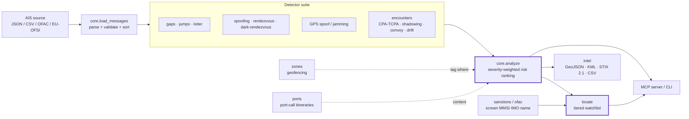
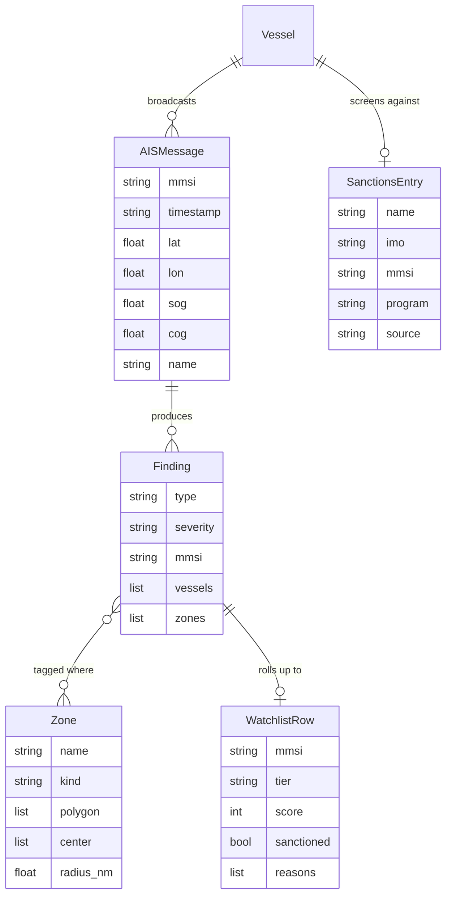

# Architecture

`maritimeint` turns raw AIS position reports into a scored, explained, exportable
maritime-intelligence picture — and it does it offline, with the standard library,
on data you control. This document explains how the pieces fit together, end to end.

## The pipeline

## Components

### Core engine (`maritimeint/core.py`)
The heart of the tool. `AISMessage` validates and normalizes a position report
(`mmsi`, `timestamp`, `lat`, `lon`, optional `name`/`sog`/`cog`/`imo`);
`load_messages` reads JSON (`list` or `{"messages": […]}`) or provider CSV. Seven
single- and pairwise detectors run over the time-sorted tracks — **gaps** (going
dark), **speed jumps** (impossible teleports), **loitering** (STS staging),
**spoofing** (identity conflict + static pinning), **rendezvous** (two hulls meet),
**dark-rendezvous** (one goes dark while another loiters at the spot), and
**GPS anomalies** (circling spoof tracks + jamming hotspots). `analyze()` runs the
whole suite plus the encounters layer and produces a **severity-weighted risk
ranking** per vessel. Pure standard library; every detector returns plain dicts.

### Encounters layer (`maritimeint/encounters.py`)
Reasons about how tracks *relate*: **close-quarters** (CPA/TCPA — closest point of
approach and time to it, the bridge-watch collision-avoidance primitive),
**shadowing** (persistent trailing at a held standoff), **convoy** (co-movement
clusters), and **drift** (not-under-command / possible distress). It computes
*separation*, never an intercept or any maneuvering instruction — situational
awareness and force protection only.

### Spatial layer (`maritimeint/zones.py`, `maritimeint/ports.py`)
`zones` geofences findings against EEZs, sanctioned ports, and exclusion / war-risk
boxes (GeoJSON polygons/points or a native list), answering *where* an event
happened with a ray-casting point-in-polygon test. `ports` infers dwell-based port
calls from the tracks and sequences them into per-vessel itineraries, flagging legs
that touch a sanctioned or high-risk port — the classic load-at-sanctioned,
sell-at-clean-hub laundering pattern.

### Sanctions screening (`maritimeint/sanctions.py`, `ofac.py`, `sanctions_sources.py`)
`sanctions.screen()` matches a vessel against a designation list by **MMSI**, **IMO**
(the durable hull-bound identity), or **name**. `ofac` imports the real US Treasury
SDN.CSV (network optional — pass a local file for CI/offline), pulling IMO/MMSI out
of the Remarks field; sister importers cover EU / UK OFSI / OpenSanctions formats.

### Watchlist (`maritimeint/locate.py`)
`locate()` is the one-call answer to *"which vessels, and why?"* — it fuses the
behavioural risk ranking with a sanctions screen and tiers every vessel
**HIGH / MEDIUM / LOW** with plain-language reasons. A sanctions hit is a hard
escalation to HIGH regardless of behaviour score.

### Export (`maritimeint/intel.py`)
Turns any `analyze()` result into **GeoJSON** (maps), **KML** (Google Earth),
**STIX 2.1** (threat-intel platforms), and **CSV** (notebooks) with zero
dependencies. STIX ids are deterministic (`uuid5` over the finding) so output is
byte-stable and pipeline-diffable.

### Surfaces (`maritimeint/cli.py`, `mcp_server.py`, `menu.py`)
A full argparse CLI exposes every detector and the `analyze` / `locate` /
`encounters` / `zones` / `port-calls` / `export` modes; an MCP server serves the
same capabilities to AI agents; an interactive menu wraps it for non-CLI users.

## Data model

## Why these choices

- **Standard library, no heavy deps.** Detectors are plain geometry over plain
  dicts. The whole tool runs anywhere Python runs, including air-gapped CI.
- **Offline by default.** Bundled AIS / sanctions / zone fixtures mean every demo
  and test runs with no network and no API keys. Live importers are opt-in.
- **Defensive scope.** Everything is detection and situational awareness over open
  broadcast data — never navigation correction, intercept, or targeting. See
  [`DISCLAIMER.md`](../DISCLAIMER.md).
- **Findings are the contract.** Every detector emits the same plain-dict shape, so
  the risk ranking, the watchlist, the zone tagger, and all four exporters compose
  without special cases.
