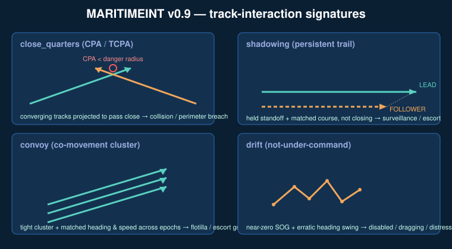

# Track-interaction & behaviour intelligence (`encounters`) — v0.9

> **Scope.** This is a **defensive, situational-awareness / OSINT** capability. It
> computes how vessel *tracks relate to one another* and how a single track
> *behaves over time*, from historical AIS. It does **not** plan intercepts, issue
> maneuvering orders, or do anything resembling targeting or fire-control — every
> output is a *separation* or a *pattern label* for an analyst. The CPA/TCPA math
> here is the same relative-motion model a bridge collision-avoidance radar runs,
> applied retrospectively for early-warning and force protection.



*Diagram: generated SVG, CC0 / public domain — no third-party imagery.*

---

## Why this layer exists

The detectors in `maritimeint.core` score each vessel largely **in isolation**:
gaps, speed jumps, loitering, single-vessel spoofing. That misses the entire class
of threats and safety events that only appear in the **relationship between
tracks** or in the **time-evolution of one track**:

| Question the core can't answer | This layer's detector |
|---|---|
| *Did two contacts come dangerously close — or are they on a converging course right now?* | `close_quarters` (CPA / TCPA) |
| *Is one vessel persistently following another at a held standoff?* | `shadowing` |
| *Are these "unrelated" tracks actually moving as one formation?* | `convoy` |
| *Is that vessel adrift / not-under-command — a possible distress?* | `drift` |

All four are **pure standard library**, additive, and folded into both
`maritimeint analyze` (master report + risk ranking) and a dedicated
`maritimeint encounters` subcommand. Findings flow unchanged through the existing
GeoJSON / KML / STIX 2.1 / CSV exporters.

---

## 1. `close_quarters` — CPA / TCPA

**Closest Point of Approach (CPA)** is the minimum range two vessels will reach if
both hold their current velocity; **Time to CPA (TCPA)** is when that happens. This
is the canonical maritime collision-avoidance primitive (COLREGs watchkeeping) and,
for force protection, the standoff-perimeter primitive (*did an unknown contact
close inside our exclusion radius?*).

**How it works.** For every vessel pair, at each moment their reports are within a
short time tolerance, the engine takes each vessel's instantaneous velocity
(reported `sog`/`cog`, or derived from neighbouring fixes), projects both forward as
straight lines, and solves for the time that minimises their separation
(`tcpa = -(r·v) / |v|²` in the relative frame). A negative TCPA means CPA is already
behind them, so current range is reported instead. The **smallest CPA across the
whole encounter** is kept.

```bash
maritimeint close-quarters ais.json --cpa-nm 0.5 --tcpa-max-minutes 30
```

```json
{
  "type": "close_quarters",
  "vessels": ["CQ_A", "CQ_B"],
  "cpa_nm": 0.0,
  "tcpa_minutes": 29.9,
  "range_at_detection_nm": 9.0,
  "severity": "high"
}
```

A small CPA with a short, **positive** TCPA is a *converging* close-quarters
situation. Two ships steaming parallel 5 nm apart, or diverging, never trip it.

---

## 2. `shadowing` — persistent trailing at standoff

One vessel holding station *behind* another, at a roughly constant distance, on a
matched course, for an extended period. This is **distinct from a rendezvous**
(which closes to contact) and from a convoy (a tight abreast cluster). It is a
documented surveillance / interdiction / escort-precursor signature.

**How it works.** For each pair the engine collects time-aligned report overlaps
where (a) separation is inside `[standoff_min, standoff_max]` nm — close but *not*
touching, (b) the two courses agree within `course_tol`, and (c) the geometry says
one is behind the other along the shared course (the trailer's bearing from the
leader opposes the direction of travel). If enough overlaps span enough time, it
reports the pair, the **leader/follower roles** (majority vote for stability), and
the mean/min/max standoff.

```bash
maritimeint shadowing ais.json --standoff-max-nm 8 --min-minutes 90
```

---

## 3. `convoy` — co-movement clustering

A group of vessels moving together as a formation — escort groups, shepherded
grey-fleet flotillas, coordinated transfers — that per-vessel anomaly detection
treats as unrelated tracks.

**How it works.** Time is bucketed into epochs. Within each epoch the vessels are
**single-link clustered** by proximity, and an edge only forms between two vessels
if they *also* share heading (within `course_tol`) and speed (within `speed_tol`).
Clusters of at least `min_vessels` are remembered by their membership set; any set
that re-forms across `min_epochs` separate epochs is reported as a convoy. Three
ships steaming abreast at the same speed and heading flag; three scattered ships, or
three at wildly different speeds, do not.

```bash
maritimeint convoy ais.json --cluster-nm 3 --min-vessels 3
```

---

## 4. `drift` — not-under-command / distress

A powered vessel holding station keeps a steady heading; a vessel **adrift** (lost
propulsion, anchor dragging, not-under-command) creeps along at near-zero speed
while its heading swings with the set of current and wind. This is a **safety /
possible-distress early-warning** signal — explicitly *not* an anomaly-of-intent.

**How it works.** The engine finds maximal runs of consecutive fixes where speed
(reported, or displacement-derived to catch missing `sog`) stays under `max_sog`,
then measures the spread of inter-fix headings across the run. A run that lasts long
enough **and** swings widely is flagged. A slow vessel on a perfectly steady heading
(holding station under power) is not adrift and does not flag.

```bash
maritimeint drift ais.json --max-sog-kn 1.5 --min-minutes 60
```

---

## Combined run

```bash
# all four interaction/behaviour detectors at once
maritimeint encounters ais.json --format json

# or get them folded into the full master report + risk ranking
maritimeint analyze ais.json
```

`analyze` now reports `close_quarters`, `shadowing`, `convoy`, and `drift` counts
alongside the existing seven detectors, and the new findings feed the per-vessel
risk score exactly like every other finding (high = 3, medium = 2).

---

## Walkthrough: a converging close-quarters event

```bash
$ maritimeint encounters demos/05-encounters/ais.json
MARITIMEINT report  vessels=2  messages=12
finding counts:
  close_quarters 1
  shadowing      0
  convoy         0
  drift          0
findings (1):
  [  high] close_quarters   CQ_A,CQ_B
```

Two contacts on reciprocal courses at the same latitude are projected to pass with
CPA ~0 nm inside the next 30 minutes — flagged `high`. Export it to a map and hand
it to a watch officer:

```bash
maritimeint export demos/05-encounters/ais.json --to geojson -o cpa.geojson
```

---

## Tuning reference

| Detector | Key knobs | Default | Raise to… | Lower to… |
|---|---|---|---|---|
| `close_quarters` | `cpa_nm`, `tcpa_max_minutes` | 0.5 nm / 30 min | reduce noise in dense lanes | tighten a standoff perimeter |
| `shadowing` | `standoff_max_nm`, `min_minutes` | 8 nm / 90 min | catch looser/longer trails | catch tighter/shorter trails |
| `convoy` | `cluster_nm`, `min_vessels` | 3 nm / 3 | require bigger formations | catch pairs/looser groups |
| `drift` | `max_sog_kn`, `min_minutes` | 1.5 kn / 60 min | catch slow-creep drift | require near-dead-in-water |

## Limitations (candid)

- **CPA assumes constant velocity** over the projection — a vessel that turns
  invalidates the forward projection, so CPA is an *instantaneous* estimate, re-run
  per report. It is an early-warning heuristic, not a guarantee.
- **Sparse or laggy AIS** weakens every pairwise detector; the time-tolerance knobs
  (`max_pair_dt`) trade coverage for precision.
- **Shadowing/convoy can be coincidental** in heavy traffic separation schemes
  where many ships legitimately share a lane — treat as a lead, corroborate with
  zone context (`--zones`) and the other detectors.
- **Drift vs. fishing/station-keeping**: a trawler working a slow pattern or a DP
  vessel holding station can resemble drift; the heading-swing gate filters most,
  but vessel-type context (not in raw AIS position reports) would improve it.
